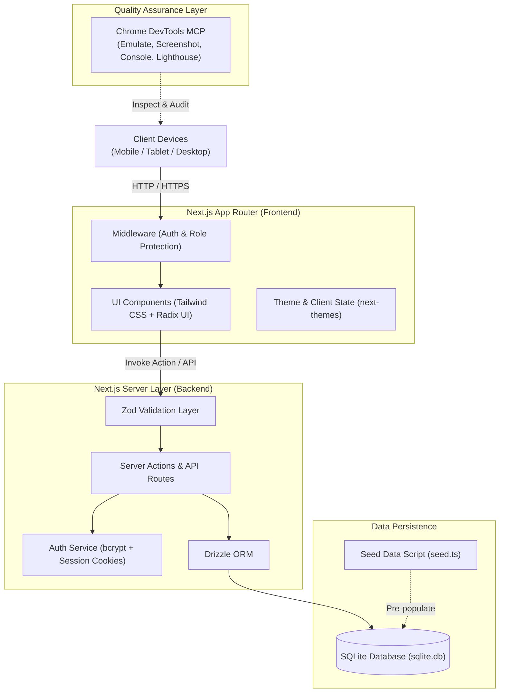
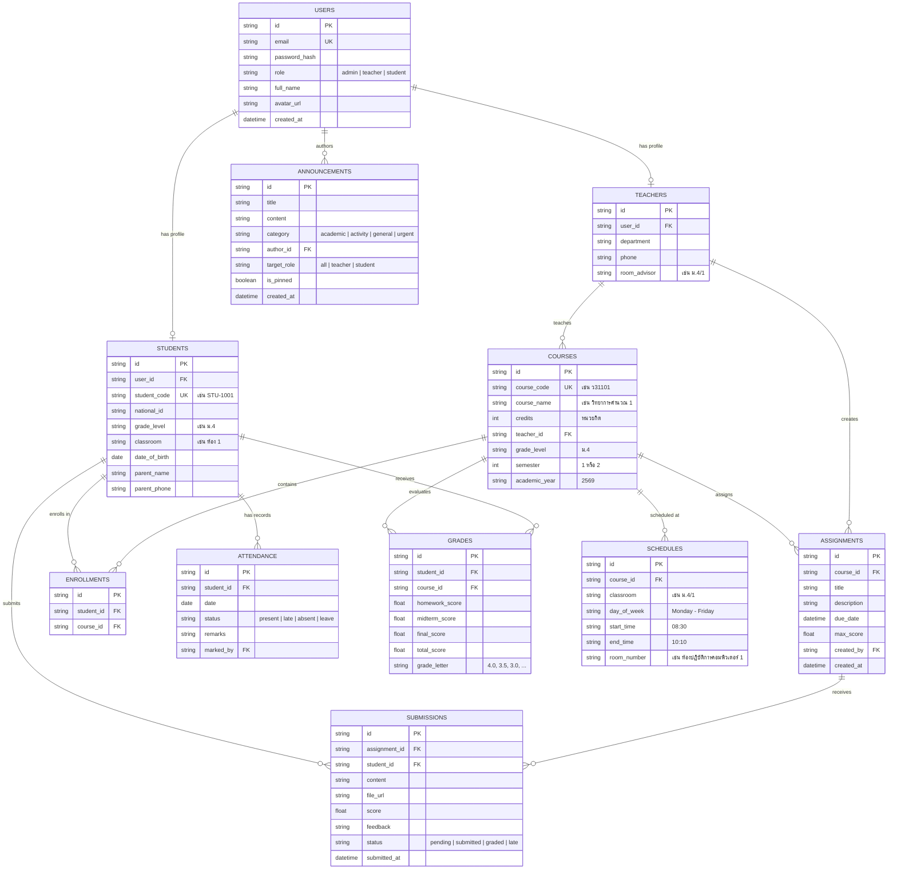

# สถาปัตยกรรมระบบและฐานข้อมูล (System Architecture & Database Design)

> **ระบบ:** ระบบบริหารจัดการสถานศึกษาและข้อมูลนักเรียนแบบครบวงจร (School & Student Management System - SMS)  
> **ฐานข้อมูล:** SQLite ผ่าน Drizzle ORM

---

## 1. แผนภาพสถาปัตยกรรมระบบ (System Architecture Diagram)



---

## 2. แผนผังความสัมพันธ์ของข้อมูล (Entity-Relationship Diagram)



---

## 3. รายละเอียดตารางฐานข้อมูล (Database Tables Schema)

### 3.1 ตาราง `users`
- เก็บบัญชีผู้ใช้งานหลักทุก Role สำหรับ Login
- `id` (TEXT, PK, UUIDv4 หรือ nanoid)
- `email` (TEXT, UNIQUE, NOT NULL)
- `password_hash` (TEXT, NOT NULL)
- `role` (TEXT, NOT NULL) — ค่าที่เป็นไปได้: `'admin'`, `'teacher'`, `'student'`
- `full_name` (TEXT, NOT NULL) — ชื่อ-นามสกุล ภาษาไทย
- `avatar_url` (TEXT)
- `created_at` (INTEGER / TIMESTAMP)

### 3.2 ตาราง `teachers`
- ข้อมูลจำเพาะสำหรับคุณครู
- `id` (TEXT, PK)
- `user_id` (TEXT, FK -> users.id, UNIQUE)
- `department` (TEXT) — กลุ่มสาระการเรียนรู้ (เช่น วิทยาศาสตร์และเทคโนโลยี, ภาษาไทย, คณิตศาสตร์)
- `phone` (TEXT)
- `room_advisor` (TEXT) — ชั้นเรียนประจำห้อง (เช่น "ม.4/1")

### 3.3 ตาราง `students`
- ข้อมูลจำเพาะสำหรับนักเรียน
- `id` (TEXT, PK)
- `user_id` (TEXT, FK -> users.id, UNIQUE)
- `student_code` (TEXT, UNIQUE, NOT NULL) — รหัสประจำตัวนักเรียน 5 หลัก
- `national_id` (TEXT) — รหัสบัตรประชาชน (Masked)
- `grade_level` (TEXT, NOT NULL) — ระดับชั้น เช่น "ม.4"
- `classroom` (TEXT, NOT NULL) — ห้องเรียน เช่น "ห้อง 1"
- `date_of_birth` (TEXT)
- `parent_name` (TEXT)
- `parent_phone` (TEXT)

### 3.4 ตาราง `courses`
- ข้อมูลรายวิชา
- `id` (TEXT, PK)
- `course_code` (TEXT, UNIQUE) — เช่น "ว31101", "ค31101"
- `course_name` (TEXT) — เช่น "วิทยาการคำนวณ 1", "คณิตศาสตร์พื้นฐาน"
- `credits` (REAL) — หน่วยกิต (เช่น 1.0, 1.5)
- `teacher_id` (TEXT, FK -> teachers.id)
- `grade_level` (TEXT)
- `semester` (INTEGER)
- `academic_year` (TEXT)

### 3.5 ตาราง `attendance`
- ข้อมูลบันทึกการเข้าเรียนรายวัน
- `id` (TEXT, PK)
- `student_id` (TEXT, FK -> students.id)
- `date` (TEXT) — รูปแบบ `YYYY-MM-DD`
- `status` (TEXT) — `'present'`, `'late'`, `'absent'`, `'leave'`
- `remarks` (TEXT)
- `marked_by` (TEXT, FK -> users.id)

### 3.6 ตาราง `grades`
- ผลการเรียนและคะแนนเก็บ
- `id` (TEXT, PK)
- `student_id` (TEXT, FK -> students.id)
- `course_id` (TEXT, FK -> courses.id)
- `homework_score` (REAL)
- `midterm_score` (REAL)
- `final_score` (REAL)
- `total_score` (REAL)
- `grade_letter` (TEXT) — "4.0", "3.5", ..., "0"

### 3.7 ตาราง `schedules`
- ตารางเรียน / ตารางสอนประจำสัปดาห์
- `id` (TEXT, PK)
- `course_id` (TEXT, FK -> courses.id)
- `classroom` (TEXT) — เช่น "ม.4/1"
- `day_of_week` (TEXT) — "จันทร์", "อังคาร", "พุธ", "พฤหัสบดี", "ศุกร์"
- `start_time` (TEXT) — เช่น "08:30"
- `end_time` (TEXT) — เช่น "10:10"
- `room_number` (TEXT) — เช่น "อาคาร 3 ห้อง 321"

### 3.8 ตาราง `announcements`
- ข่าวสารและประกาศของโรงเรียน
- `id` (TEXT, PK)
- `title` (TEXT, NOT NULL)
- `content` (TEXT, NOT NULL)
- `category` (TEXT) — `'academic'`, `'activity'`, `'general'`, `'urgent'`
- `author_id` (TEXT, FK -> users.id)
- `target_role` (TEXT) — `'all'`, `'teacher'`, `'student'`
- `is_pinned` (INTEGER, 0 หรือ 1)
- `created_at` (INTEGER / TIMESTAMP)

### 3.9 ตาราง `assignments` และ `submissions`
- งานที่มอบหมายและการส่งงาน
- มีความสัมพันธ์เชื่อมโยงกับรายวิชา ครูผู้สร้าง และนักเรียนที่ส่งงาน

---

## 4. โครงสร้างโฟลเดอร์ที่แนะนำ (Project Directory Structure)

```
students/
├── AGENTS.md                  # กฎการทำงานและมาตรฐานสำหรับ Agent & นักพัฒนา
├── GEMINI.md                  # ลิงก์อ้างอิงระดับโปรเจกต์
├── docs/                      # เอกสารสถาปัตยกรรมและ Requirements
│   ├── requirements.md        # ข้อกำหนดระบบทั้งหมด
│   ├── architecture.md        # แผนภาพสถาปัตยกรรมและ Schema
│   ├── testing-chrome-mcp.md  # คู่มือการทดสอบด้วย Chrome DevTools MCP
│   └── tools-and-setup.md     # คู่มือเครื่องมือและสภาพแวดล้อม
├── src/
│   ├── app/                   # Next.js App Router (Pages, Layouts, API)
│   │   ├── (auth)/login/      # หน้าเข้าสู่ระบบ
│   │   ├── (dashboard)/       # พื้นที่ Dashboard ที่มีการป้องกันสิทธิ์
│   │   │   ├── admin/         # หน้าสำหรับ Admin
│   │   │   ├── teacher/       # หน้าสำหรับ คุณครู
│   │   │   └── student/       # หน้าสำหรับ นักเรียน
│   │   ├── api/               # API Routes (ถ้ามี)
│   │   ├── layout.tsx         # Root Layout พร้อม Theme Provider
│   │   └── page.tsx           # Landing Page & Quick Entry
│   ├── components/            # Reusable React Components
│   │   ├── ui/                # Base UI (Button, Card, Dialog, Table, Badge, Form)
│   │   ├── layout/            # Sidebar, Topbar, BottomNav, MobileDrawer
│   │   ├── attendance/        # Quick Checklist, Attendance Chart
│   │   ├── gradebook/         # Score Input Table, Transcript View
│   │   └── shared/            # ThemeToggle, UserAvatar, ConfirmDialog
│   ├── lib/                   # Utility Libraries
│   │   ├── db/                # Drizzle ORM client, schema definitions
│   │   │   ├── schema.ts      # ตารางข้อมูลทั้งหมด
│   │   │   └── index.ts       # Database connection instance
│   │   ├── auth.ts            # Session validation, cookie handling, password verify
│   │   └── utils.ts           # Helper functions (date formatting, grade calculator)
│   └── seed/                  # Seed Script
│       └── seed.ts            # ข้อมูลตั้งต้นสมจริง (Admin, ครู 5 คน, นร 25 คน, วิชา, เกรด)
├── drizzle.config.ts          # Drizzle ORM Configuration
├── package.json
├── tailwind.config.ts
└── tsconfig.json
```
