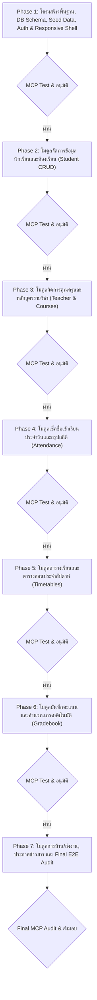

# แผนการพัฒนาแบบเป็นขั้นเป็นตอน (Phased Development Roadmap)

> **ชื่อระบบ:** ระบบบริหารจัดการสถานศึกษาและข้อมูลนักเรียนแบบครบวงจร (School & Student Management System - SMS)  
> **รูปแบบการพัฒนา:** 7 Modular Phases (พัฒนาทีละโมดูล ตรวจสอบผ่าน Chrome DevTools MCP อย่างละเอียด และรอการอนุมัติก่อนเริ่ม Phase ถัดไป)  
> **หลักการคุณภาพ:** Full-Stack ทำงานได้จริง, Full-Responsive ทุกขนาดหน้าจอ, และ Zero Console Errors

---

## แผนผังภาพรวมการพัฒนา (Roadmap Overview)

---

## บัญชีผู้ใช้งานเริ่มต้นสำหรับทดสอบ (Default Seed Credentials)

| บทบาท (Role) | Email เข้าสู่ระบบ | รหัสผ่าน (Password) | สิทธิ์การเข้าถึง |
| :--- | :--- | :--- | :--- |
| **Admin** | `admin@school.ac.th` | `password123` | เข้าถึง `/admin/*` และทุกส่วนของระบบ |
| **Teacher** | `somchai.t@school.ac.th` | `password123` | เข้าถึง `/teacher/*` (ครูประจำชั้น ม.4/1, สอนวิชาวิทยาการคำนวณ) |
| **Student** | `somying.s@school.ac.th` | `password123` | เข้าถึง `/student/*` (นักเรียน ม.4/1, รหัส STU-1001) |

---

## รายละเอียดแต่ละ Phase (Phase Breakdown)

---

### Phase 1: โครงสร้างพื้นฐาน, ฐานข้อมูล, ระบบความปลอดภัย และ Responsive Shell Layout

#### 1. เป้าหมาย (Goal)
ติดตั้งและกำหนดค่าโปรเจกต์ Next.js (App Router), TypeScript, Tailwind CSS, Radix UI, Drizzle ORM และ SQLite (`better-sqlite3`) พร้อมสร้าง Database Schema ครบ 10 ตาราง, สคริปต์ Seed Data ภาษาไทยสมจริง, ระบบ Authentication ด้วย bcrypt และ HTTP-only Session Cookie, Middleware ตรวจสอบสิทธิ์ 3 Roles, และโครงสร้าง Responsive Layout (Sidebar บน Desktop, Drawer บน Mobile, สลับ Dark/Light Mode)

#### 2. สิ่งที่ต้องส่งมอบ (Deliverables)
- โครงสร้างโปรเจกต์ Next.js 15+ พร้อมตั้งค่า TypeScript strict mode
- ไฟล์นิยามตารางฐานข้อมูล SQLite (`src/lib/db/schema.ts`) ทั้ง 10 ตาราง
- สคริปต์ Seed ข้อมูลจำลองสถานศึกษาภาษาไทย (`src/seed/seed.ts`) พร้อมคำสั่ง `npm run db:seed`
- ระบบ Authentication (`src/lib/auth.ts`, `src/middleware.ts` และหน้า `src/app/(auth)/login/page.tsx`) แบบฟอร์มมาตรฐาน
- Shell Layout:
  - Desktop (≥ 1280px): Persistent Collapsible Sidebar ด้านซ้าย + Top Navigation Bar
  - Mobile (320px – 430px): Hamburger Drawer รูดเปิด-ปิดได้ลื่นไหล ไม่ล้นจอ
  - Tablet (768px – 1024px): Responsive Adaptive Layout
  - `ThemeToggle`: สวิตช์สลับ Dark Mode / Light Mode สมบูรณ์

#### 3. เกณฑ์การตรวจรับด้วย Chrome DevTools MCP (Acceptance Criteria)
1. **การแสดงผลหน้า Login & Shell:**
   - ทดสอบบน Mobile Viewport (`390 x 844`): ฟอร์ม Login สวยงาม ช่องกรอกและปุ่มกดขนาด ≥ 44px ไม่มี Horizontal Scrollbar
   - ทดสอบบน Desktop Viewport (`1440 x 900`): จัดวางกึ่งกลางอย่างสมดุล
2. **การทำงานของระบบ Auth:**
   - ล็อกอินด้วย `admin@school.ac.th` สำเร็จและ Redirect ไปยัง `/admin`
   - ล็อกอินด้วย `somchai.t@school.ac.th` สำเร็จและ Redirect ไปยัง `/teacher`
   - ล็อกอินด้วย `somying.s@school.ac.th` สำเร็จและ Redirect ไปยัง `/student`
   - ทดสอบเข้าหน้าที่ไม่มีสิทธิ์ (เช่น Student พยายามเข้า `/admin`) ต้องถูก Block และ Redirect ไปหน้า Access Denied หรือ Login
3. **Console & Error:**
   - `list_console_messages` ต้อง **Zero Errors** (ไม่มี React Hydration Error หรือ Uncaught Exception)
4. **ภาพหลักฐาน:** ถ่ายภาพ Screenshot หน้า Login และ Layout หลักทั้งแบบ Mobile และ Desktop เพื่อขออนุมัติ

---

### Phase 2: โมดูลจัดการข้อมูลนักเรียนและห้องเรียน (Student & Classroom Management)

#### 1. เป้าหมาย (Goal)
พัฒนาระบบ CRUD ข้อมูลนักเรียนสำหรับผู้ดูแลระบบและคุณครู รองรับการแสดงผลแบบตารางข้อมูล (Data Table) บนคอมพิวเตอร์ และการ์ดข้อมูล (Card View) บนมือถือ พร้อมระบบค้นหา, กรองตามระดับชั้น (ม.1 – ม.6), ฟอร์มเพิ่ม/แก้ไขนักเรียนที่มีการตรวจสอบข้อมูล (Validation) และการส่งออกข้อมูลเป็น CSV

#### 2. สิ่งที่ต้องส่งมอบ (Deliverables)
- หน้าแสดงรายการนักเรียน (`src/app/(dashboard)/admin/students/page.tsx`)
- ระบบค้นหาเรียลไทม์ (ค้นหาจากชื่อ, รหัสนักเรียน, หรือเลขบัตรประชาชน)
- ตัวกรองตามระดับชั้นและห้องเรียน (Grade Level & Classroom Filter)
- โมดอล/ฟอร์ม เพิ่มและแก้ไขข้อมูลนักเรียน พร้อม Zod validation (Client + Server Action)
- หน้ารายละเอียดโปรไฟล์นักเรียน (`/admin/students/[id]`) แสดงข้อมูลส่วนตัวและผู้ปกครอง
- ฟังก์ชัน Export รายชื่อนักเรียนเป็นไฟล์ CSV

#### 3. เกณฑ์การตรวจรับด้วย Chrome DevTools MCP (Acceptance Criteria)
1. **Responsive Table Check:**
   - บน Desktop (`1440 x 900`): Data Table แสดงคอลัมน์ครบถ้วน มี Sorting, Pagination และ Action Buttons
   - บน Mobile (`390 x 844`): ข้อมูลแสดงเป็นการ์ดที่อ่านง่าย ไม่มีข้อความล้นขอบจอ ไม่เกิด Horizontal Overflow
2. **Functional Test:**
   - ทดสอบค้นหาชื่อนักเรียนที่มีใน Seed Data (เช่น "สมหญิง") ต้องแสดงผลถูกต้อง
   - ทดสอบเพิ่มนักเรียนใหม่ 1 คน บันทึกลง SQLite สำเร็จและแสดงผลในตารางทันที
   - ทดสอบกด Export CSV ได้รับข้อมูลถูกต้อง
3. **Console & Error:** Zero Console Errors ผ่าน `list_console_messages`

---

### Phase 3: โมดูลจัดการคุณครูและหลักสูตรรายวิชา (Teacher & Course Management)

#### 1. เป้าหมาย (Goal)
พัฒนาระบบจัดการข้อมูลคุณครู (กลุ่มสาระฯ, ข้อมูลติดต่อ, ชั้นเรียนที่ปรึกษา) และระบบจัดการหลักสูตรรายวิชา (รหัสวิชา, ชื่อวิชา, หน่วยกิต, ครูผู้สอนที่รับผิดชอบ, ภาคเรียน) พร้อมระบบเชื่อมโยงการลงทะเบียนเรียนของนักเรียนในห้อง

#### 2. สิ่งที่ต้องส่งมอบ (Deliverables)
- หน้ารายชื่อคุณครูและบุคลากร (`src/app/(dashboard)/admin/teachers/page.tsx`)
- ฟอร์มเพิ่ม/แก้ไขข้อมูลครู พร้อมระบุห้องประจำชั้น
- หน้ารายวิชาและหลักสูตร (`src/app/(dashboard)/admin/courses/page.tsx`)
- ฟอร์มเพิ่ม/แก้ไขรายวิชา เชื่อมโยงครูผู้สอนและหน่วยกิต
- แสดงรายชื่อนักเรียนที่ลงทะเบียนในแต่ละรายวิชา

#### 3. เกณฑ์การตรวจรับด้วย Chrome DevTools MCP (Acceptance Criteria)
1. **Responsive Layout:**
   - ทดสอบหน้าแสดงรายการครูและรายวิชาทั้งบน Mobile (`390 x 844`) และ Desktop (`1440 x 900`)
2. **Functional Test:**
   - ทดสอบเพิ่มรายวิชาใหม่ กำหนดครูผู้สอน และตรวจสอบการผูกข้อมูลกับฐานข้อมูล SQLite
   - ทดสอบแก้ไขข้อมูลครูประจำชั้น
3. **Console & Error:** Zero Console Errors

---

### Phase 4: โมดูลเช็คชื่อเข้าเรียนประจำวันและสรุปสถิติ (Attendance Tracking & Analytics)

#### 1. เป้าหมาย (Goal)
พัฒนาระบบบันทึกการเข้าเรียนของนักเรียนสำหรับครูผู้สอน/ครูประจำชั้น พร้อมปุ่มบันทึกด่วน, แดชบอร์ดสรุปสถิติการมาเรียนสำหรับผู้บริหาร (Admin) และหน้าดูประวัติการเข้าเรียนของนักเรียนเอง (Student)

#### 2. สิ่งที่ต้องส่งมอบ (Deliverables)
- หน้าเช็คชื่อประจำวันสำหรับครู (`src/app/(dashboard)/teacher/attendance/page.tsx`):
  - รายชื่อนักเรียนพร้อมสวิตช์สถานะ 4 รูปแบบ: **มาเรียน (Present)**, **สาย (Late)**, **ลา (Leave)**, **ขาด (Absent)**
  - ปุ่ม Quick Action: **"มาเรียนทั้งหมด"** เพื่อความสะดวกรวดเร็ว
  - บันทึกลงตาราง `attendance` ในฐานข้อมูล
- หน้าแดชบอร์ดสถิติสำหรับ Admin (`/admin/attendance`):
  - กราฟอัตราการมาเรียนเฉลี่ยรายวัน/รายสัปดาห์ (Attendance Rate %)
  - รายชื่อนักเรียนที่ขาดเรียนสะสมเกินเกณฑ์
- หน้าประวัติการเข้าเรียนสำหรับนักเรียน (`src/app/(dashboard)/student/attendance/page.tsx`):
  - สรุปเปอร์เซ็นต์การมาเรียนและตารางประวัติย้อนหลัง

#### 3. เกณฑ์การตรวจรับด้วย Chrome DevTools MCP (Acceptance Criteria)
1. **Interactive Checklist Test:**
   - ใช้ MCP จำลองการคลิกเช็คชื่อบนหน้าจอมือถือและเดสก์ท็อป
   - ทดสอบกดปุ่ม "มาเรียนทั้งหมด" และปรับนักเรียนบางคนเป็น "สาย" หรือ "ลา" จากนั้นกดบันทึก
2. **Data Consistency:** ข้อมูลถูกบันทึกลง SQLite และเมื่อรีเฟรชหน้าจอข้อมูลยังคงอยู่ถูกต้อง
3. **Responsive Chart:** กราฟสถิติปรับขนาดตามหน้าจอ Mobile ไม่ยืดล้น และแสดงผลสวยงาม
4. **Console & Error:** Zero Console Errors

---

### Phase 5: โมดูลตารางเรียนและตารางสอนประจำสัปดาห์ (Weekly Timetable & Schedules)

#### 1. เป้าหมาย (Goal)
พัฒนาระบบแสดงตารางเรียนและตารางสอนประจำสัปดาห์ (วันจันทร์ – วันศุกร์) โดยจัดรูปแบบให้เข้ากับทั้งหน้าจอขนาดใหญ่ (แบบ Grid ตารางสอนมาตรฐาน) และหน้าจอมือถือ (แบบแยกแท็บรายวันหรือ Timeline Card เพื่อง่ายต่อการดูบนสมาร์ตโฟน)

#### 2. สิ่งที่ต้องส่งมอบ (Deliverables)
- ระบบจัดการตารางสอนสำหรับ Admin (`src/app/(dashboard)/admin/schedules/page.tsx`)
- หน้าตารางสอนสำหรับครู (`src/app/(dashboard)/teacher/schedule/page.tsx`) แสดงวิชาที่ต้องสอนในแต่ละคาบ
- หน้าตารางเรียนสำหรับนักเรียน (`src/app/(dashboard)/student/timetable/page.tsx`) แสดงวิชา, ห้องเรียน, และครูผู้สอน
- UI Responsive Design:
  - Desktop: Weekly Timetable Grid (5 วัน x คาบเรียน)
  - Mobile: Day-by-Day Tab View (กดสลับ จันทร์/อังคาร/พุธ/พฤหัส/ศุกร์) ป้องกันการเลื่อนจอแนวนอนที่ใช้งานยาก

#### 3. เกณฑ์การตรวจรับด้วย Chrome DevTools MCP (Acceptance Criteria)
1. **Mobile UX Verification:**
   - ตรวจสอบบน Mobile (`390 x 844`) ว่าการเปลี่ยนแท็บวันทำงานได้ลื่นไหล ไม่มีการล้นหน้าจอ (Zero Horizontal Scroll)
2. **Desktop Grid Verification:**
   - ตรวจสอบบน Desktop (`1440 x 900`) ว่าแสดงข้อมูลคาบเรียน รหัสวิชา และห้องเรียนครบถ้วน
3. **Console & Error:** Zero Console Errors

---

### Phase 6: โมดูลบันทึกคะแนนและคำนวณเกรดอัตโนมัติ (Gradebook & Grading System)

#### 1. เป้าหมาย (Goal)
พัฒนาระบบกรอกคะแนนเก็บ คะแนนสอบกลางภาค และคะแนนสอบปลายภาคสำหรับครูผู้สอน พร้อมคำนวณคะแนนรวมและตัดเกรดอัตโนมัติตามเกณฑ์มาตรฐาน 8 ระดับ (0, 1.0, 1.5, 2.0, 2.5, 3.0, 3.5, 4.0) ตลอดจนหน้ารายงานผลการเรียน (Transcript / Grade Report) สำหรับนักเรียนและผู้บริหาร

#### 2. สิ่งที่ต้องส่งมอบ (Deliverables)
- หน้าบันทึกคะแนนสำหรับครู (`src/app/(dashboard)/teacher/grades/page.tsx`):
  - ตารางกรอกคะแนนแยกช่อง: คะแนนเก็บ (เต็ม 50), กลางภาค (เต็ม 20), ปลายภาค (เต็ม 30)
  - คำนวณคะแนนรวม (เต็ม 100) และแปลงเป็นเกรดตัวเลขทันทีแบบเรียลไทม์
  - ปุ่มบันทึกผลการเรียนลงฐานข้อมูล
- หน้ารายงานผลการเรียนสำหรับนักเรียน (`src/app/(dashboard)/student/grades/page.tsx`):
  - แสดงเกรดแต่ละวิชา, หน่วยกิต, และเกรดเฉลี่ยสะสม (GPA)
  - มุมมองสำหรับสั่งพิมพ์ใบรายงานผลการเรียน (Print-friendly Transcript View)
- หน้ารายงานสรุปเกรดภาพรวมสำหรับ Admin (`/admin/grades`)

#### 3. เกณฑ์การตรวจรับด้วย Chrome DevTools MCP (Acceptance Criteria)
1. **Calculation Verification:**
   - ทดสอบกรอกคะแนนทดสอบ: เก็บ 45 + กลางภาค 18 + ปลายภาค 25 = รวม 88 -> ระบบต้องแสดงเกรด 4.0 อย่างถูกต้อง
   - ทดสอบกรณีได้คะแนนต่ำกว่า 50 -> ต้องแสดงเกรด 0
2. **Transcript Responsive & Print Check:**
   - ตรวจสอบการแสดงผลตารางเกรดบนมือถือและเดสก์ท็อป
3. **Console & Error:** Zero Console Errors

---

### Phase 7: โมดูลการบ้าน/ส่งงาน, ประกาศข่าวสาร และ Final System Audit

#### 1. เป้าหมาย (Goal)
พัฒนาระบบมอบหมายการบ้านและตรวจงาน (Assignments & Submissions) สำหรับครูและนักเรียน, กระดานประกาศข่าวสารและกิจกรรมของโรงเรียน (School Announcements), และดำเนินการทดสอบคุณภาพระบบรวมขั้นสุดท้าย (End-to-End Audit) ด้วย Chrome DevTools MCP ทั้งในด้านความเข้ากันได้ของหน้าจอ, ความเร็ว, และ Lighthouse Score

#### 2. สิ่งที่ต้องส่งมอบ (Deliverables)
- ระบบการบ้าน (Assignments):
  - ครูสร้างการบ้านใหม่ กำหนดวันส่ง คะแนนเต็ม และคำอธิบาย
  - นักเรียนดูรายการการบ้าน แนบคำตอบ/ลิงก์ส่งงาน และดูสถานะ (รอส่ง / ส่งแล้ว / ตรวจแล้ว)
  - ครูตรวจงาน ให้คะแนน และใส่ข้อเสนอแนะ (Feedback)
- ระบบประกาศข่าวสาร (Announcements):
  - Admin สร้างประกาศ ปักหมุดข่าวสำคัญ และกำหนดสิทธิ์การมองเห็น
  - ข่าวสารแสดงบนหน้า Dashboard ของทุกบทบาท
- **Final System Audit ผ่าน Chrome DevTools MCP:**
  - รัน `lighthouse_audit` บนหน้าหลัก: คะแนน Performance, Accessibility, Best Practices, SEO ต้อง ≥ 90
  - ตรวจสอบการทำงานของทุกลิงก์และทุกหน้าจอใน 3 วิวพอร์ต (Mobile 390px, Tablet 768px, Desktop 1440px)
  - ทดสอบการสลับ Dark Mode / Light Mode ในทุกหน้าจอ
  - ส่งมอบโปรเจกต์ฉบับสมบูรณ์พร้อมคู่มือการรัน

#### 3. เกณฑ์การตรวจรับด้วย Chrome DevTools MCP (Acceptance Criteria)
1. **Full Flow Verification:** ตรวจสอบ Flow ตั้งแต่สร้างการบ้าน -> ส่งงาน -> ตรวจงาน -> บันทึกคะแนน
2. **Lighthouse Audit Gate:** ทุกหมวดหมู่คะแนนต้องได้มากกว่าหรือเท่ากับ 90 คะแนน
3. **Zero Errors Guarantee:** ไม่มี Uncaught Error หรือ Failed Network Request ในทุกหน้าจอ

---

## สรุปข้อตกลงในการส่งมอบงานแต่ละ Phase

> **กฎเหล็กในการทำงาน:**
> 1. เมื่อพัฒนาแต่ละ Phase เสร็จแล้ว จะต้องรันเซิร์ฟเวอร์ และใช้ **Chrome DevTools MCP** เข้าไปทดสอบบนอุปกรณ์จริง (Mobile, Tablet, Desktop)
> 2. แคปภาพ Screenshot นำมาแสดงผล พร้อมสรุปสิ่งที่ทำไปทั้งหมด
> 3. **หยุดรอให้คุณตรวจสอบผลงานและอนุมัติ (Approve)** ก่อนเสมอ จึงจะเริ่มเขียนโค้ดของ Phase ถัดไป!
