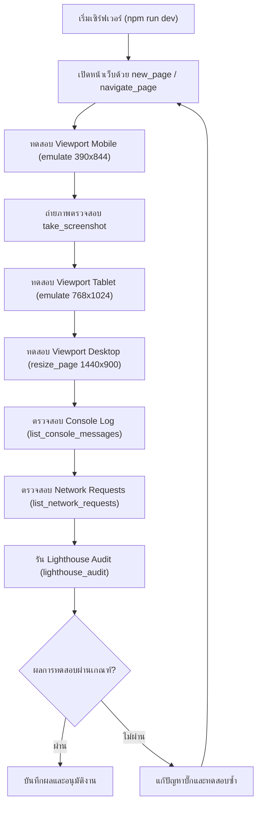

# คู่มือการทดสอบระบบด้วย Chrome DevTools MCP (Chrome DevTools Testing Protocol)

เอกสารนี้ระบุวิธีและขั้นตอนการทดสอบระบบเว็บแอปพลิเคชันอย่างครบวงจรโดยใช้ **Chrome DevTools MCP**

---

## 1. วัตถุประสงค์ในการทดสอบ
1. ตรวจสอบการแสดงผลแบบ **Full-Responsive** ในอุปกรณ์ทุกระดับ (Mobile 375-430px, Tablet 768-1024px, Desktop 1280-1440px)
2. ตรวจสอบ **Zero Console Error** และ **Zero Unhandled Promise Rejection**
3. ตรวจสอบสถานะการเชื่อมต่อ Network และ API Call (HTTP Status 200/201)
4. ตรวจสอบคุณภาพเว็บไซต์ด้วย **Lighthouse Audit** (Performance, Accessibility, Best Practices, SEO)

---

## 2. ขั้นตอนการทดสอบมาตรฐาน (Standard Test Flow)

---

## 3. รายการเครื่องมือ MCP ที่ใช้บ่อย

| เครื่องมือ MCP | หน้าที่ | ตัวอย่างการใช้งาน |
| :--- | :--- | :--- |
| `navigate_page` | นำทางไปยัง URL ที่ต้องการ | เปิดหน้าเว็บ เช่น `http://localhost:3000` |
| `emulate` | จำลองขนาดหน้าจอ, Touch screen, Device Scale | ทดสอบ iPhone 14 (`width: 390, height: 844, mobile: true`) |
| `resize_page` | ปรับขนาดหน้าต่าง Browser | ปรับเป็น Desktop (`width: 1440, height: 900`) |
| `take_screenshot` | บันทึกภาพหน้าจอเป็นภาพหลักฐาน | จับภาพ UI ทั้งหน้าจอเพื่อตรวจ Layout Shift |
| `list_console_messages` | ดึงรายการข้อความใน Console ทั้งหมด | ตรวจหา React Warnings, Hydration Error, Uncaught Exception |
| `list_network_requests` | ดึงรายการ HTTP requests ทั้งหมด | เช็คว่า API / Static assets โหลดสำเร็จ ไม่เกิด 404/500 |
| `lighthouse_audit` | ตรวจสอบประสิทธิภาพและมาตรฐานเว็บ | เช็คคะแนน Accessibility, Performance, Best Practices |
| `click`, `fill`, `type_text` | จำลองการคลิกและกรอกข้อมูล | ทดสอบฟอร์ม Login, Register, CRUD แบบ End-to-End |
